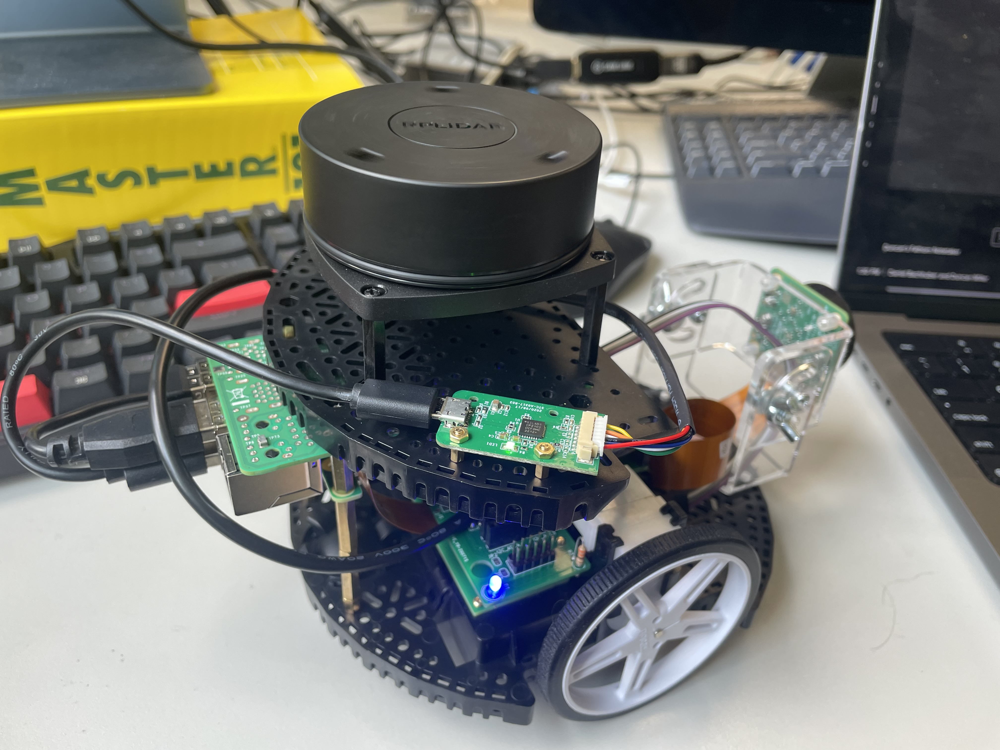
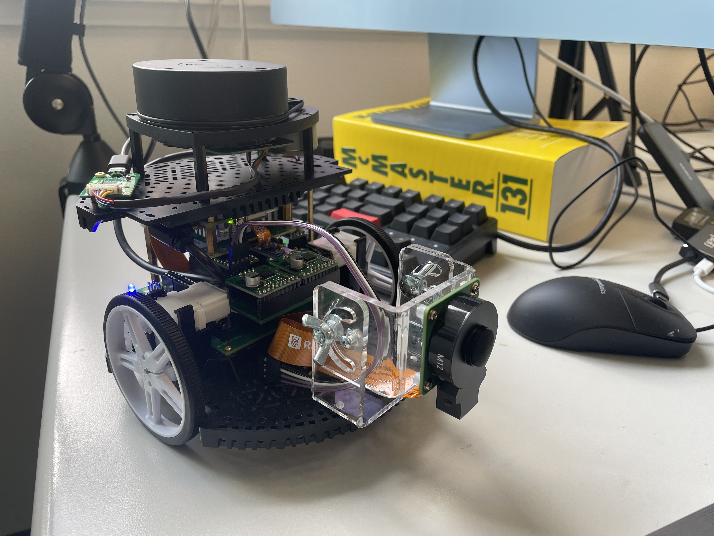

# Hardware Builds Repository

A collection of robot build documentation, including Bills of Materials (BOMs), assembly guides, and supporting resources for educational robotics projects.

## Repository Structure

```
hardware-builds/
├── README.md                 # This file
├── boms/                     # Bill of Materials documents
│   └── mobile-base-sensors-v1.md
├── builds/                   # Complete build documentation
├── guides/                   # Step-by-step assembly guides
├── images/                   # Photos and diagrams
└── resources/               # Supporting materials
    ├── datasheets/          # Component datasheets
    └── schematics/          # Circuit diagrams and PCB files
```

## Directory Descriptions

### `/boms/`
Contains detailed Bills of Materials for various robot builds. Each BOM includes:
- Complete component lists with suppliers and pricing
- Assembly notes and power requirements
- Tool requirements and safety considerations
- Version history for tracking changes

### `/builds/`
Complete build documentation combining BOMs, guides, and additional resources for specific robot configurations.

### `/guides/`
Step-by-step assembly instructions, including:
- Hardware assembly procedures
- Software setup and configuration
- Troubleshooting guides
- Testing and calibration procedures

### `/images/`
Visual documentation including:
- Assembly photos
- Wiring diagrams
- Component identification images
- Completed build photos

### `/resources/`
Supporting technical documentation:
- **`datasheets/`**: Component specifications and technical data
- **`schematics/`**: Circuit diagrams, PCB layouts, and electrical designs

## Current Builds

### Mobile Base + Sensors v1.0
**Purpose:** Educational robotics platform for first in-person course
**BOM:** [`boms/mobile-base-sensors-v1.md`](boms/mobile-base-sensors-v1.md)

**Key Features:**
- Differential drive mobile platform
- Raspberry Pi 5 with AI HAT+ for computation
- Stereo vision camera system
- 9DOF IMU for navigation
- Optional robot arm attachment
- Real-time motor control via Teensy 4.0

**Build Images:**


*Back view of the mobile base showing rear components and connections*


*Side view of the mobile base with LiDAR sensor mounted*

## Contributing

We welcome and encourage contributions!

Make sure to check out the PARTs GitHub site:
````
https://github.com/portlandrobotics/common_platform
````
Rather than duplicating work, we'll use [the PARTS docs](https://parts-common-platform.readthedocs.io/en/latest/) and focus on helping them strengthen documentation. Most of this documentation is currently boilerplate - so lets fill it in! This can be a great way to rack up some git commits to an active open source robotics project.

🔗 **[PARTs Common Platform](https://github.com/portlandrobotics/common_platform)**
Complete open-source robotics platform with detailed assembly guides, 3D models, and ROS2 integration.

### Contributing to this repository

Feel free to build on your own **[at your own risk!]**, **fork this repository**, and/or **submit pull requests**.

When adding new builds or updating an existing BOM:

1. **BOMs**: Create versioned files in `/boms/` with detailed component information
2. **Images**: Store in `/images/` with descriptive filenames

## Safety Notes

⚠️ **Important Safety Considerations:**
- Always follow proper LiPo battery handling procedures
- Ensure emergency stops are accessible and functional
- Use appropriate safety equipment when soldering or assembling
- Verify power connections before applying power
- Keep datasheets accessible during assembly

## License

This repository is licensed under the [MIT License](LICENSE). This repository contains educational materials for robotics instruction. Please respect component manufacturer trademarks and licensing when using this documentation.

---
*Repository maintained for educational robotics courses*

## Disclaimer

This project is a **work in progress** and provided **as-is**.
- It is **not production-ready**.
- Use is intended for **educational and experimental purposes only**.
- By using these files, you accept that you are doing so **at your own risk**.
